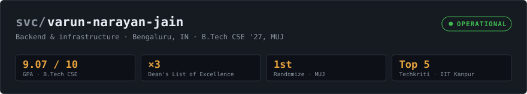
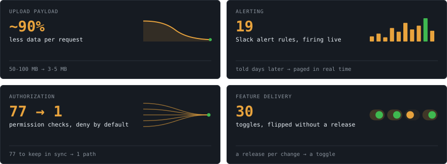
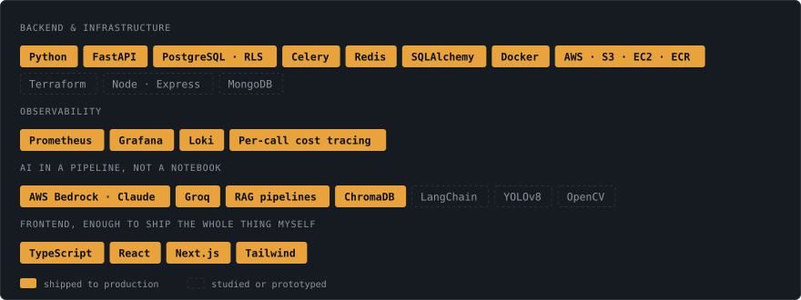
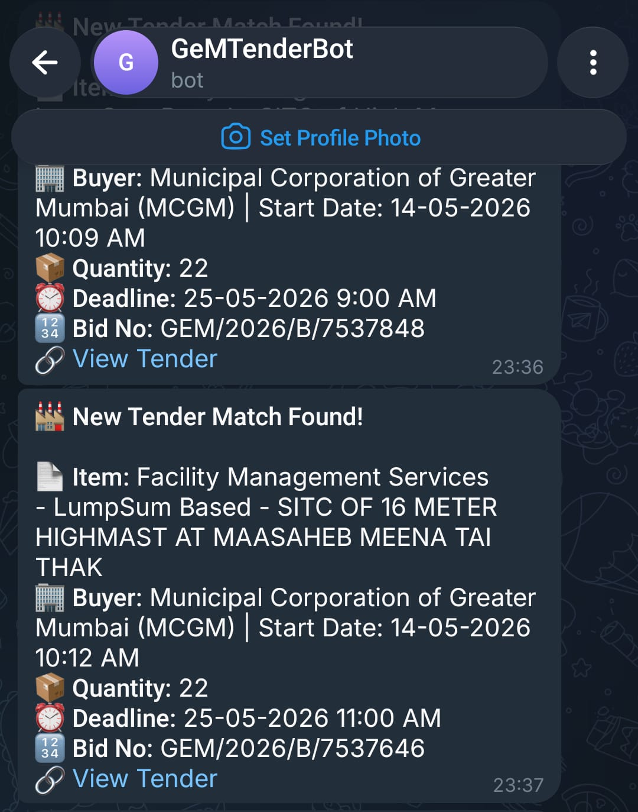
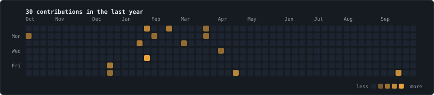

<div align="center">

<!-- Portrait. 6,569 circles, one per pixel of a downscaled crop, grouped by row
     with a staggered CSS animation-delay so it scans itself in over ~2.5s.
     Regenerate with:
       python scripts/dotify.py assets/source-varun.jpg -o assets/portrait \
         --cols 104 --crop 0.18,0.03,0.80,0.72 --equalize --colour photo -->


<br><br>

<!-- Banner. Uptime bars are the last 90 days of real contribution counts.
     Redrawn every 6 hours by .github/workflows/refresh.yml -->
<picture>
  <source media="(prefers-color-scheme: dark)"  srcset="assets/banner-dark.svg">
  <source media="(prefers-color-scheme: light)" srcset="assets/banner-light.svg">
  
</picture>

<br><br>

<a href="https://www.linkedin.com/in/varun-narayan-jain-b45697256/"></a>
<a href="mailto:varunnarayanjaincorporate@gmail.com"></a>
<a href="https://leetcode.com/u/Varun_Narayan_Jain/"></a>
<!-- PORTFOLIO: add the badge here once the site is deployed. Left out on purpose --
     a dead link is worse than a missing one, and recruiters click.
<a href="https://REPLACE-ME"></a>
-->

</div>

---

## `GET` /whoami

```jsonc
// 200 OK · 12ms
{
  "role":     "Software engineer, backend & infrastructure",
  "now":      "SWE Intern @ SeedlingLabs, Bengaluru",
  "before":   "SWE Intern @ Tata Advanced Systems",
  "i_write":  "the pipelines that move data, the rules that decide who can
               see what, and the alerts that catch a problem before a
               customer does",
  "studying": "B.Tech Computer Science, Manipal University Jaipur, 2023–2027",
  "gpa":      "9.07 / 10 · Dean's List ×3",
  "open_to":  "2027 new-grad backend / infra roles",
  "reach_me": "varunnarayanjaincorporate@gmail.com"
}
```

---

## `GET` /metrics

Four things I changed in systems that were already running. A number on its own
is a boast; a number between a before and an after is evidence.

<div align="center">
<picture>
  <source media="(prefers-color-scheme: dark)"  srcset="assets/metrics-dark.svg">
  <source media="(prefers-color-scheme: light)" srcset="assets/metrics-light.svg">
  
</picture>
</div>

---

## `GET` /stack

Filled means it has been run in production — in an internship, or a project
that real people use. Dashed means studied or prototyped. That distinction is
the only reason this section is worth reading.

<div align="center">
<picture>
  <source media="(prefers-color-scheme: dark)"  srcset="assets/stack-dark.svg">
  <source media="(prefers-color-scheme: light)" srcset="assets/stack-light.svg">
  
</picture>
</div>

---

## `GET` /deployments

<table>
<tr>
<td width="33%" valign="top">



**[GeM Tender Automation](https://github.com/VarunNarayanJain/Tender-Automation)**
`live`

An agentic Playwright scraper over Government e-Marketplace listings. An LLM
scores every tender for relevance and bid-readiness, rows land in Google
Sheets, and Telegram fires on a match — deleting a recurring manual review
from a live procurement workflow.

`Python` `Playwright` `Groq` `Sheets API`

</td>
<td width="33%" valign="top">


**[Smart Retail Analytics](https://github.com/VarunNarayanJain/Smart-Retail-Analytics-using-Computer-Vision)**
`5.30 fps`

Real-time footfall counting, occupancy tracking and Gaussian heatmaps on
commodity hardware — no GPU, no cloud, no stored imagery. YOLOv8n detection
paired with SORT tracking behind a React and Vite dashboard.

`Python` `OpenCV` `YOLOv8` `SORT`

</td>
<td width="33%" valign="top">


**[Academic Early Warning](https://github.com/VarunNarayanJain/Emerging-Tools-Technologies)**
[`live`](https://emerging-tools-technologies.vercel.app/)

Replaces manual review of student performance with automated risk tiering
across 15 data models and 5 parameters. A ChromaDB and Groq RAG pipeline
retrieves per-student context and drafts intervention plans for counsellors.

`FastAPI` `Supabase` `ChromaDB` `React`

</td>
</tr>
</table>

---

<!-- ============================================================================
     /traces is written and ready, but commented out on purpose.

     GitHub currently attributes only 27 contributions to this account in the
     last year, and zero in the last 90 days -- even though repos here were
     pushed as recently as July 2026. That means commits are being authored
     with an email GitHub cannot match to the account, so they earn no
     contribution credit.

     Shipping an empty calendar is worse than shipping no calendar. Fix the
     attribution first:

       1. Settings > Emails -- add every email you commit with (the
          noreply address is fine), and check `git config user.email`.
       2. Settings > Profile -- tick "Include private contributions on my
          profile", so SeedlingLabs work counts.
       3. Add a PAT with read:user as secrets.METRICS_TOKEN, so the workflow
          can read private contributions too.

     Then delete this comment and the two markers below, and run
     `python scripts/render.py` -- the panels fill in.
     ============================================================================ -->

<!--
## `GET` /traces

<div align="center">

<picture>
  <source media="(prefers-color-scheme: dark)"  srcset="assets/traces-dark.svg">
  <source media="(prefers-color-scheme: light)" srcset="assets/traces-light.svg">
  
</picture>

<br><br>

<!-- Regenerated nightly by .github/workflows/snake.yml into the output branch -->
<picture>
  <source media="(prefers-color-scheme: dark)"  srcset="https://raw.githubusercontent.com/VarunNarayanJain/VarunNarayanJain/output/snake-dark.svg">
  <source media="(prefers-color-scheme: light)" srcset="https://raw.githubusercontent.com/VarunNarayanJain/VarunNarayanJain/output/snake.svg">
  
</picture>

</div>

---

-->

## `GET` /changelog

Experience, framed the way it actually happened: things added, changed and
removed in systems that were already running.

<table>
<tr>
<td width="140" valign="top">

</td>
<td valign="top">

### `v2.0.0` &nbsp;SeedlingLabs &nbsp;·&nbsp; <sub>Software Engineering Intern · Bengaluru · Jun 2026 →</sub>

- **Added** — the company's first production observability stack: Prometheus,
  7 Grafana dashboards, Loki log search, 19 Slack alert rules, and per-call
  cost tracing that attributes AI spend per school.
- **Changed** — textbook processing became an object-oriented asynchronous
  pipeline on Celery, Redis and S3 pre-slicing, with retry-backoff and
  concurrency caps, ending upload failures under load.
- **Added** — a golden dataset for question-paper generation, role-based access
  control over PostgreSQL row-level security, and fail-closed guards that block
  AI calls when the governance layer goes down.
- **Removed** — 77 scattered API permission checks, migrated onto one
  deny-by-default school/org/plan override chain. 30 features now toggle per
  school without a code release.

</td>
</tr>
<tr>
<td width="140" valign="top">

</td>
<td valign="top">

### `v1.0.0` &nbsp;Tata Advanced Systems &nbsp;·&nbsp; <sub>Software Engineering Intern · Mumbai · Jun – Jul 2025</sub>

- **Added** — automated raster layer ingestion to Bhugyan GIS, cutting
  end-to-end map render time, after ramping onto an unfamiliar geospatial
  codebase in weeks.
- **Removed** — manual steps from the map publishing workflow, via CLI and
  Docker pipelines covering WMS publishing, seeding and unpublishing.
- **Changed** — extended the automation framework with coordinate conversions,
  GIS annotations, and graph algorithms for shortest path and visibility
  analysis.

</td>
</tr>
</table>

---

<div align="center">
<sub>

Every panel above is an SVG generated by [`scripts/render.py`](scripts/render.py) inside this
repo's own Action and committed to [`assets/`](assets) — not fetched from a shared
render service that can be rate-limited at the moment someone opens this page.

</sub>
</div>
